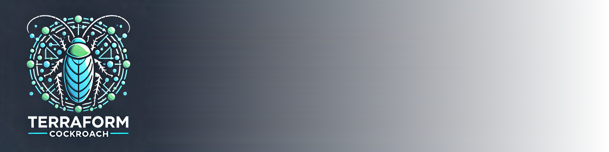
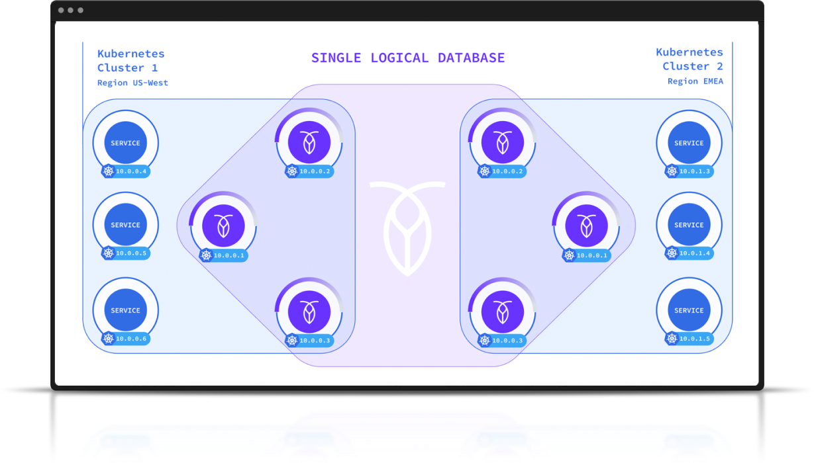
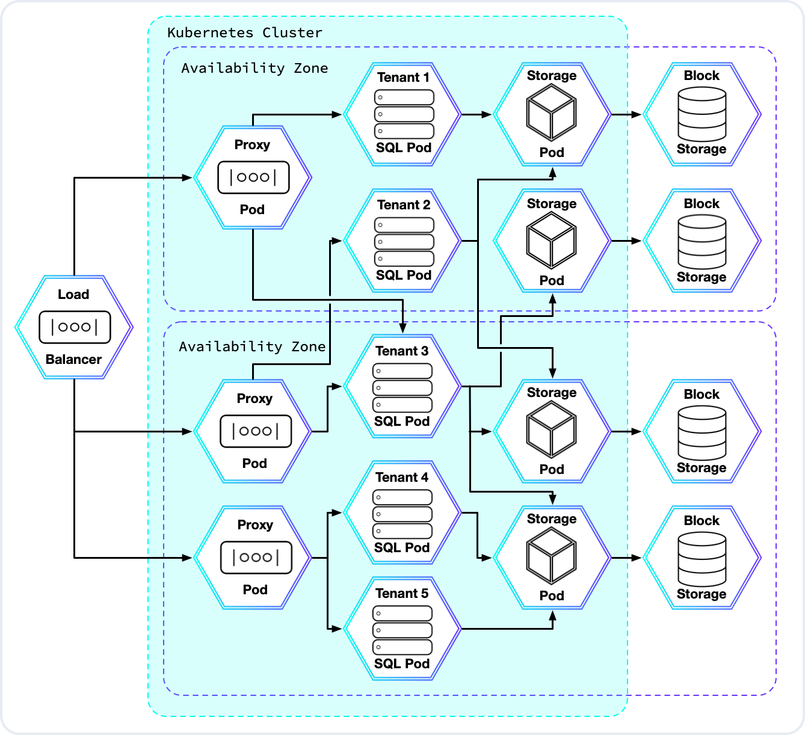

= TF-Roach
:linkattrs:
:project-owner: amineelkouhen
:project-name:  tf-roach
:project-group: com.cockroachlabs
:project-version:   1.0.0
:site-url:  https://github.com/amineelkouhen/tf-roach

image:https://img.shields.io/github/contributors/{project-owner}/{project-name}[GitHub contributors]
image:https://img.shields.io/github/forks/{project-owner}/{project-name}[Fork]
image:https://img.shields.io/github/stars/{project-owner}/{project-name}[GitHub Repo stars]
image:https://img.shields.io/github/watchers/{project-owner}/{project-name}[GitHub watchers]
image:https://img.shields.io/github/issues/{project-owner}/{project-name}[GitHub issues]
image:https://img.shields.io/github/license/{project-owner}/{project-name}[License]

---

TF-Roach is a set of Terraform templates designed to provision different kinds of CockroachDB Clusters across multiple cloud vendors.

Currently only AWS, GCP and Azure are supported.

The terraform state file is currently maintained locally. This means:

* Only one deployment is supported for each directory where the script is executed (terraform state file)
* Deployments created by other individuals will not be updatable

== Prerequisites

- Install https://learn.hashicorp.com/tutorials/terraform/install-cli[Terraform^]
- Create an SSH key file (~/.ssh/id_rsa)

=== AWS setup

- Download an https://docs.aws.amazon.com/IAM/latest/UserGuide/id_credentials_access-keys.html[AWS service account key file^]
- In the file `variables.tf`, update the variables "aws_access_key" and "aws_secret_key" with the first and second entries of the AWS service account key file.

== CockroachDB - Architecture

CockroachDB is a distributed SQL database built on a transactional and strongly-consistent key-value store. It scales horizontally; survives disk, machine, rack, and even datacenter failures with minimal latency disruption and no manual intervention; supports strongly-consistent ACID transactions; and provides a familiar SQL API for structuring, manipulating, and querying data.

CockroachDB scales horizontally with minimal operator overhead: At the key-value level, CockroachDB starts off with a single, empty range. As you put data in, this single range eventually reaches a threshold size. When that happens, the data splits into two ranges, each covering a contiguous segment of the entire key-value space. This process continues indefinitely; as new data flows in, existing ranges continue to split into new ranges, aiming to keep a relatively small and consistent range size.

image::images/ranges.gif[CRL]

A CockroachDB cluster is composed of identical nodes that are deployed within a data center or stretched across multiple regions / availability zones.

image::images/multi-regional.png[CRL]

== CockroachDB - Deployment

In the `main` folder, there exist multiple configurations that create CockroachDB Clusters, on the main cloud providers, and with multiple deployment options:

- Self-Hosted on Virtual Machines,
- Self-Hosted on Cloud Kubernetes Services (EKS, GKE, AKS) => TBC,
- Managed (using CockroachDB Serverless) => TBC

=== Self-Hosted CockroachDB on VM

[cols="25h,~,~"]
|===
^.^h|Cloud Provider
^.^h|Regional Deployment ^.^h|Multi-Region Deployment

^.^|Amazon Web Services (AWS)

a|image::main/aws/Regional/Multi_Zonal_Clusters/images/Regional-Multi-AZ.svg[Basic, link="main/aws/Regional/Multi_Zonal_Clusters"]
a|image::main/aws/Multi-Region/Multi_Zonal_Clusters/images/Multi-Region-Multi-AZ.svg[Multi-Zonal, link="main/aws/Multi-Region/Multi_Zonal_Clusters"]

^.^|Google Cloud Platform (GCP)

a|image::images/TBC.png[Basic Cluster, link=""]
a|image::images/TBC.png[Basic Cluster, link=""]

^.^|Microsoft Azure

a|image::images/TBC.png[Basic Cluster, link=""]
a|image::images/TBC.png[Basic Cluster, link=""]

|===

=== Self-Hosted CockroachDB on Kubernetes

Another way to deploy CockroachDB is to use the CockroachDB Kubernetes https://www.cockroachlabs.com/docs/releases/kubernetes-operator[Operator] for Kubernetes. It provides a simple way to get a CockroachDB cluster on Kubernetes and enables more complex deployment scenarios.

Operator allows CockroachDB to maintain a unified deployment solution across various Kubernetes environments, i.e., RedHat OpenShift, VMware Tanzu (Tanzu Kubernetes Grid, and Tanzu Kubernetes Grid Integrated Edition, formerly known as PKS), Google Kubernetes Engine (GKE), Azure Kubernetes Service (AKS), and vanilla (upstream) Kubernetes.

==== Prerequisites

To deploy CockroachDB on Kubernetes using the configuration, you’ll need:

- the cloud provider's CLI (ex. https://cloud.google.com/sdk/gcloud[GCloud], https://learn.microsoft.com/en-us/cli/azure/[Azure CLI], https://aws.amazon.com/fr/cli/[AWS CLI]) installed and configured,
- a Kubernetes client (ex. https://kubernetes.io/docs/tasks/tools/install-kubectl-linux/[kubectl]).

==== Configuration files

In the `main` folder, there exist multiple configurations that create CockroachDB Clusters, on the main cloud providers, using the managed Kubernetes services of each cloud provider (AKS for Azure, EKS for AWS and GKE for Google Cloud).

[cols="25h,~,~"]
|===
^.^h|Cloud Provider
^.^h|Regional Deployment ^.^h|Multi-Region Deployment

^.^|Elastic Kubernetes Service (EKS)

a|image::images/TBC.png[Basic Cluster, link=""]
a|image::images/TBC.png[Basic Cluster, link=""]

^.^|Google Kubernetes Engine (GKE)

a|image::images/TBC.png[Basic Cluster, link=""]
a|image::images/TBC.png[Basic Cluster, link=""]

^.^|Azure Kubernetes Service (AKS)

a|image::images/TBC.png[Basic Cluster, link=""]
a|image::images/TBC.png[Basic Cluster, link=""]

|===

=== CockroachDB Serverless

CockroachDB Serverless delivers free and pay-as-you-go CockroachDB clusters for you and your organization. It is a managed instance of CockroachDB that lets you start using your database immediately and auto-scales based on your application traffic.

A Serverless cluster is an isolated, virtualized tenant running on a much larger physical CockroachDB deployment.
CockroachDB Serverless has separate compute and storage layers. The storage pods (KV pods) can be shared across users, and the compute pods (SQL pods) are unique to each user. These shared resources make CockroachDB Serverless architecture "multi-tenant," in contrast to the single tenant architecture of CockroachDB Dedicated.

Traffic comes in from the public internet and is routed by the cloud provider’s load balancer to a Kubernetes (K8s) cluster that hosts CockroachDB. K8s pods allow CockroachDB Serverless to limit SQL resource consumption for each user. They also minimize interference between pods that are scheduled on the same machine, giving each user a high-quality experience even when other users are running heavy workloads.

The following diagram is a high-level representation of what a typical Serverless cluster looks like:

You can provision CockroachDB Cloud clusters and cluster resources by using the templates below. These templates use the CockroachDB Cloud Terraform https://registry.terraform.io/providers/cockroachdb/cockroach[provider].

[cols="25h,~,~"]
|===
^.^h|Cloud Provider
^.^h|Regional Deployment ^.^h|Multi-Region Deployment

^.^|Amazon Web Services (AWS)

a|image::images/TBC.png[Basic Cluster, link=""]
a|image::images/TBC.png[Basic Cluster, link=""]

^.^|Google Cloud Platform (GCP)

a|image::images/TBC.png[Basic Cluster, link=""]
a|image::images/TBC.png[Basic Cluster, link=""]

^.^|Microsoft Azure

a|image::images/TBC.png[Basic Cluster, link=""]
a|image::images/TBC.png[Basic Cluster, link=""]

|===

=== Usage

Each configuration consists of one (or many) JSON file(s) (*.tf.json) that calls one or many modules depending on the configuration.
For each cloud provider, it exists a networking module to create VPCs/VNETs, subnets and load balancers, a DNS module to create the cluster's FQDN, and a cockroach (cr) module that creates the cluster nodes.
Other modules exist for specific purposes like the peering or keypair modules...

If a client is added (the bastion module is called), a standalone machine will be created with a few pre-installed packages (https://github.com/fabiog1901/dbworkload[db-workload], the https://github.com/amine-crl/trade-app-crdb-multi-region/tree/main[trade demo application], and much more).

Example of a configuration file

[source,json]
{
    "provider": {
        "aws": {
            "region": "${var.region_name}",
            "access_key": "${var.aws_access_key}",
            "secret_key": "${var.aws_secret_key}"
        }
    },
    "module": {
        "network-vpc": {
            "source": "../../../../modules/aws/network",
            "name": "${var.deployment_name}-${var.env}",
            "vpc_cidr": "${var.vpc_cidr}",
            "resource_tags" : {},
            "subnets_cidrs": "${var.subnets}"
        },
        "keypair": {
            "source": "../../../../modules/aws/keypair",
            "name": "${var.deployment_name}-${var.env}",
            "ssh_public_key": "${var.ssh_public_key}",
            "resource_tags" : {}
        },
        "cr-cluster": {
            "source": "../../../../modules/aws/cr",
            "name": "${var.deployment_name}-${var.env}",
            "worker_count": "${var.cluster_size}",
            "machine_type": "${var.machine_type}",
            "machine_image": "${var.machine_images}",
            "resource_tags" : {},
            "ssh_user": "${var.ssh_user}",
            "ssh_public_key": "${var.ssh_public_key}",
            "ssh_key_name": "${module.keypair.key-name}",
            "security_groups": "${module.network-vpc.security-groups}",
            "region": "${var.region}",
            "availability_zones": "${keys(var.subnets)}",
            "subnets": "${module.network-vpc.subnets}",
            "cockroach_release" : "${var.crdb_release}",
            "cluster_join_ips" : "${module.cr-cluster.cr-private-ips}",
            "boot_disk_size" : "${var.volume_size}",
            "boot_disk_type" : "${var.volume_type}"
        }
    }
}

==== Setup

- `terraform init`: To load all needed modules for the provisioning
- Review `variables.tf` to update variables like the project_name, the credentials (access and secret keys), the ssh_key... but also the configuration options like the number of nodes, type of machines, volume size, OS images, the regions, the cidr, the availability zones...

Example of the variables file

[source,hcl]
----
variable "region_name" {
  default = "us-east-1"
}

variable "vpc_cidr" {
  default = "10.1.0.0/16"
}

variable "subnets" {
  type = map
  default = {
    us-east-1a = "10.1.1.0/24"
  }
}

variable "ssh_public_key" {
  default = "~/.ssh/id_rsa.pub"
}

variable "ssh_user" {
  default = "ubuntu"
}

variable "cluster_size" {
  default = 3
}

variable "crdb_release" {
  default = "https://binaries.cockroachdb.com/cockroach-v24.1.1.linux-amd64.tgz"
}

variable "machine_type" {
  default = "t2.2xlarge"
}

variable "machine_image" {
  // Ubuntu 24.04 LTS
  default = "ami-04b70fa74e45c3917"
}
----

==== Execution

1. To check the terraform build plan, run the following command.

        terraform plan

2. To build the infrastructure, run the following command.

        terraform apply

The latest will setup a logical cluster (three physical clusters in case of a Multi-Region deployment), with 3 nodes, a VPC, subnet(s), route table(s), internet gateway(s) and a Network Load Balancer for each physical cluster (each region).

Example of a basic cluster output

....
Outputs:
####################################### Client #######################################

client-public-IP = "52.40.254.77"
demo-backend-url = "http://52.40.254.77:3000/api/data"
demo-frontend-url = "http://52.40.254.77:8080/"

####################################### CRDB Cluster #################################

console-url = "http://amine.cluster.sko-iam-demo.com:8080/"
connexion-string = "postgresql://root@amine.cluster.sko-iam-demo.com:26257/defaultdb"
cluster-dns = "amine.cluster.sko-iam-demo.com"
cr-cluster-nlb-dns = "nlb-20240703082428087000000004-b0e5c5f65a5943eb.elb.us-east-1.amazonaws.com"

cr-cluster-private-ips = [
  "10.1.1.75",
  "10.1.2.176",
  "10.1.3.188",
]
cr-cluster-public-ips = [
  "3.83.179.51",
  "3.88.140.128",
  "3.89.182.0",
]
....
